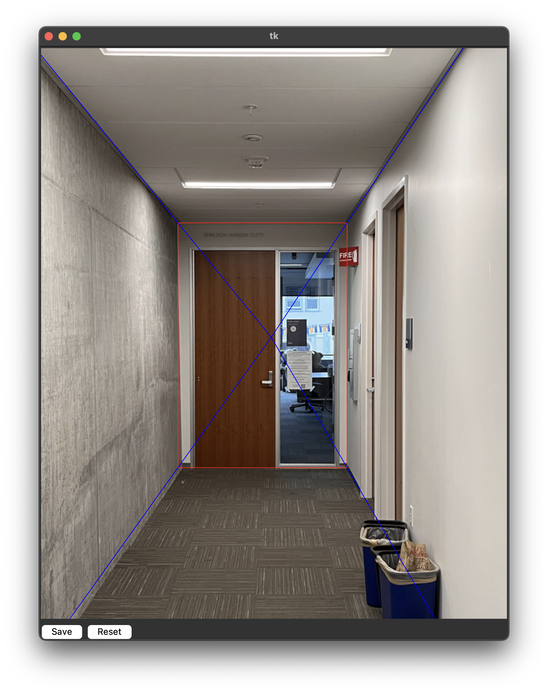

# Tour into Picture

<div class="gallery">
    <figure>
        
        <figcaption>3D Animation</figcaption>
    </figure>
    <style>
        .gallery {
            display: flex;
            justify-content: space-around;
            align-items: center;
        }
        .gallery img {
            width: 300px;
            height: auto;
        }
        .gallery figure {
            margin: 10px;
            text-align: center;
        }
    </style>
</div>

# 1. Introduction

This is a simple project following the paper [TIP](http://graphics.cs.cmu.edu/courses/15-463/2011_fall/Papers/TIP.pdf) to implement a tour into picture algorithm.

This algorithm is based on a simple assumption that the world is a box, and the camera is perpendicular to the box. For example, the following picture is a painting of a room, and the camera is perpendicular to the wall:


Then, we can build a 3D model of the room by calculating the corners of the room.

To get the vanishing point and front wall, I designed a simple GUI to annotate images. The GUI is shown below:



To visualize the 3D model, I integrate the program with [blender](https://www.blender.org/). If running the program in blender script, it will automatically generate a scene in blender. User can use blender to render the scene and check the result.

# 2. Method

Under the algorithm's assumption, all parallel lines that perpendicular to the camera will be intersected at the same point, which is called the vanishing point as you can see in the example above.

Since monocular camera will inevitably introduce scale ambiguity, we can just choose any suitable z-axis of the front wall in camera coordinate system. Then, we can get the 3D coordinate of the front wall with a calibrated camera.

After that, we can get the 3D coordinate of all other walls (left, right, ceiling, and floor) by assuming the image plane is just the back wall of the room.

To get the texture of the room, we need to use homography to project the image to the 3D model.

The algorithm is simple, we just need to divide the image into 5 piece according to the vanishing point and the front wall. Then, taking left wall as an example, we can get the homography matrix by using the 4 corners of the left wall and the 4 corners located on the left side of the image. After that, we can warp the image to the left wall.

Then, we can get the texture of all other walls (front, left, right, ceiling, and floor) by using the same method.

# 3. Usage

## 3.1. Dependencies

- python3.7 (or higher)
- numpy
- opencv-python
- matplotlib
- blender with addon "Import-Export: Import Images as Planes"

## 3.2. Run the program

To run the GUI, just run the following command:

```bash
python app.py
```

To recontruct the 3D model, run the following command:

```bash
python main.py
```

To run the program in blender, please paste `main.py` to the blender text editor and run it.


# 4. GUI interface

To get the vanishing point and front wall, I designed a simple GUI to annotate images.

User can draw a rectangle on the image to indicate the front wall, and then select the vanishing point.

After that, user can click on "Save" button to save the annotation to a text file.

# 5. 3D Animation & Result

The program will generate a box in blender. User can use blender to render the scene and check the result.

Here are three examples:

<div class="gallery">
    <figure>
        
        <figcaption>Shot at Berkeley School of Education</figcaption>
    </figure>
    <figure>
        
        <figcaption>Shot at Moffitt Library</figcaption>
    </figure>
    <figure>
        
        <figcaption>Shot at Moffitt Library</figcaption>
    </figure>
    <style>
        .gallery {
            display: flex;
            justify-content: space-around;
            align-items: center;
        }
        .gallery img {
            width: 200px;
            height: auto;
        }
        .gallery figure {
            margin: 10px;
            text-align: center;
        }
    </style>
</div>

These result are generated by the following images:

<div class="gallery">
    <figure>
        
        <figcaption>Shot at Berkeley School of Education</figcaption>
    </figure>
    <figure>
        
        <figcaption>Shot at Moffitt Library</figcaption>
    </figure>
    <figure>
        
        <figcaption>Shot at Moffitt Library</figcaption>
    </figure>
    <style>
        .gallery {
            display: flex;
            justify-content: space-around;
            align-items: center;
        }
        .gallery img {
            width: 200px;
            height: auto;
        }
        .gallery figure {
            margin: 10px;
            text-align: center;
        }
    </style>
</div>